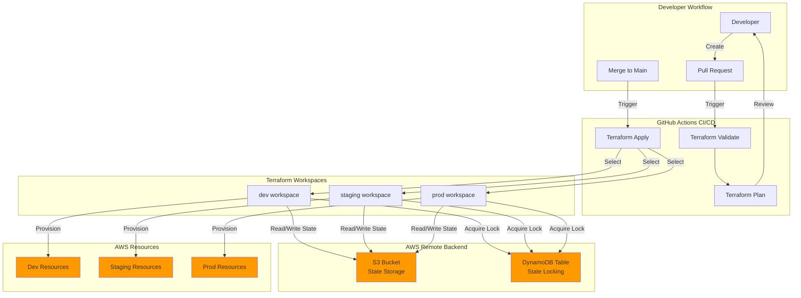
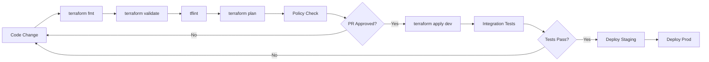

# Design Document: Terraform AWS Multi-Environment Boilerplate

## Overview

This design document specifies the architecture and implementation details for a production-ready Terraform AWS multi-environment boilerplate. The boilerplate provides a complete infrastructure-as-code foundation with support for multiple environments (dev, staging, prod) using Terraform workspaces, remote state management with S3 and DynamoDB, and automated CI/CD workflows via GitHub Actions.

### Purpose

The boilerplate serves as a starting point for AWS infrastructure projects, providing:
- Multi-environment management using Terraform workspaces
- Remote state storage with locking for team collaboration
- Automated validation and deployment via GitHub Actions
- Security best practices and proper tagging
- Modular architecture for reusable components
- Professional Spanish documentation for portfolio presentation

### Target Audience

- DevOps engineers managing AWS infrastructure
- Development teams requiring multi-environment deployments
- Freelance consultants showcasing infrastructure expertise
- Organizations adopting infrastructure-as-code practices

## Architecture

### High-Level Architecture



### Architecture Decisions

**1. Terraform Workspaces for Environment Separation**
- **Decision**: Use Terraform workspaces instead of separate directories per environment
- **Rationale**: Reduces code duplication, maintains single source of truth, simplifies maintenance
- **Trade-off**: Requires careful workspace management but provides cleaner codebase

**2. S3 + DynamoDB for Remote State**
- **Decision**: Use S3 for state storage with DynamoDB for locking
- **Rationale**: Industry standard, reliable, supports team collaboration, prevents concurrent modifications
- **Trade-off**: Requires pre-existing S3 bucket and DynamoDB table but provides robust state management

**3. GitHub Actions for CI/CD**
- **Decision**: Use GitHub Actions instead of other CI/CD platforms
- **Rationale**: Native GitHub integration, free for public repos, simple YAML configuration
- **Trade-off**: Tied to GitHub but provides seamless workflow integration

**4. Environment-Specific .tfvars Files**
- **Decision**: Store environment configurations in separate .tfvars files
- **Rationale**: Clear separation of environment settings, easy to review and modify
- **Trade-off**: Requires loading correct file per environment but provides explicit configuration

## Components and Interfaces

### File Structure

```
terraform-aws-multi-env-boilerplate/
├── .github/
│   └── workflows/
│       └── terraform.yml          # CI/CD pipeline configuration
├── docs/
│   └── architecture.png           # Architecture diagram (Mermaid)
├── environments/
│   ├── dev.tfvars                 # Development environment variables
│   ├── staging.tfvars             # Staging environment variables
│   └── prod.tfvars                # Production environment variables
├── modules/
│   └── README.md                  # Module usage documentation
├── backend.tf                     # Remote state backend configuration
├── main.tf                        # Main infrastructure resources
├── providers.tf                   # AWS provider configuration
├── variables.tf                   # Variable definitions
├── versions.tf                    # Terraform and provider version constraints
├── terraform.tfvars.example       # Example variable values
└── README.md                      # Project documentation (Spanish)
```

### Core Components

#### 1. Backend Configuration (backend.tf)

**Purpose**: Configure S3 remote backend with DynamoDB locking

**Key Features**:
- S3 bucket for state storage
- DynamoDB table for state locking
- Workspace-aware state file paths
- Server-side encryption enabled

**Interface**:
```hcl
terraform {
  backend "s3" {
    bucket         = "your-terraform-state-bucket"
    key            = "terraform/${terraform.workspace}/terraform.tfstate"
    region         = "us-east-1"
    dynamodb_table = "terraform-state-lock"
    encrypt        = true
  }
}
```

**Configuration Requirements**:
- S3 bucket must exist before initialization
- DynamoDB table must exist with LockID as primary key
- IAM permissions for S3 and DynamoDB access

#### 2. Provider Configuration (providers.tf)

**Purpose**: Configure AWS provider with authentication and default settings

**Key Features**:
- AWS provider configuration
- Region specification
- Default tags for all resources

**Interface**:
```hcl
provider "aws" {
  region = var.aws_region

  default_tags {
    tags = {
      Environment = var.environment
      ManagedBy   = "Terraform"
      Project     = var.project_name
      Workspace   = terraform.workspace
    }
  }
}
```

**Authentication Methods**:
- Environment variables (AWS_ACCESS_KEY_ID, AWS_SECRET_ACCESS_KEY)
- IAM roles (recommended for CI/CD)
- AWS CLI profiles

#### 3. Version Constraints (versions.tf)

**Purpose**: Specify Terraform and provider version requirements

**Key Features**:
- Terraform version >= 1.9.0
- AWS provider version >= 5.0.0
- Explicit provider source

**Interface**:
```hcl
terraform {
  required_version = ">= 1.9.0"

  required_providers {
    aws = {
      source  = "hashicorp/aws"
      version = ">= 5.0.0"
    }
  }
}
```

#### 4. Variable Definitions (variables.tf)

**Purpose**: Define all input variables with types, descriptions, and defaults

**Key Variables**:
- `aws_region`: AWS region for resource deployment
- `environment`: Environment name (dev/staging/prod)
- `project_name`: Project identifier for resource naming
- `tags`: Additional resource tags

**Interface**:
```hcl
variable "aws_region" {
  description = "AWS region where resources will be created"
  type        = string
  default     = "us-east-1"
}

variable "environment" {
  description = "Environment name (dev, staging, prod)"
  type        = string
}

variable "project_name" {
  description = "Project name for resource naming and tagging"
  type        = string
}

variable "tags" {
  description = "Additional tags to apply to resources"
  type        = map(string)
  default     = {}
}
```

#### 5. Main Infrastructure (main.tf)

**Purpose**: Define infrastructure resources and module calls

**Key Features**:
- Minimal working example (S3 bucket)
- Module call demonstration
- Variable usage examples
- Comments explaining structure

**Example Structure**:
```hcl
# Example S3 bucket demonstrating resource creation
resource "aws_s3_bucket" "example" {
  bucket = "${var.project_name}-${var.environment}-example"
}

# Example module call (modules can be expanded later)
module "example_module" {
  source = "./modules/example"
  
  environment  = var.environment
  project_name = var.project_name
}
```

#### 6. Environment Variable Files (environments/*.tfvars)

**Purpose**: Store environment-specific configuration values

**Structure**:
- `dev.tfvars`: Development environment settings
- `staging.tfvars`: Staging environment settings
- `prod.tfvars`: Production environment settings

**Example Content**:
```hcl
# dev.tfvars
environment  = "dev"
project_name = "my-project"
aws_region   = "us-east-1"

tags = {
  CostCenter = "Development"
  Owner      = "DevOps Team"
}
```

#### 7. CI/CD Pipeline (.github/workflows/terraform.yml)

**Purpose**: Automate Terraform validation, planning, and deployment

**Workflow Stages**:
1. **Validate**: Check Terraform syntax
2. **Plan**: Generate execution plan (on PR)
3. **Apply**: Deploy infrastructure (on merge to main)

**Key Features**:
- Workspace selection based on environment
- Automatic .tfvars file loading
- AWS authentication via GitHub secrets
- Matrix strategy for multi-environment deployment

**Workflow Structure**:
```yaml
name: Terraform CI/CD

on:
  pull_request:
    branches: [main]
  push:
    branches: [main]

jobs:
  terraform:
    runs-on: ubuntu-latest
    strategy:
      matrix:
        environment: [dev, staging, prod]
    
    steps:
      - name: Checkout code
      - name: Setup Terraform
      - name: Configure AWS credentials
      - name: Terraform Init
      - name: Select Workspace
      - name: Terraform Validate
      - name: Terraform Plan (PR only)
      - name: Terraform Apply (main branch only)
```

**Required GitHub Secrets**:
- `AWS_ACCESS_KEY_ID`: AWS access key
- `AWS_SECRET_ACCESS_KEY`: AWS secret key
- `AWS_REGION`: AWS region (optional, can use variable)

#### 8. Documentation Components

**README.md (Spanish)**:
- Project overview and benefits
- Prerequisites and setup instructions
- Usage examples for each environment
- Security considerations
- Professional presentation for portfolio

**docs/architecture.png**:
- Mermaid diagram showing architecture
- Component relationships
- Data flow visualization

**modules/README.md**:
- Module directory purpose
- Module structure guidelines
- Usage examples

## Data Models

### Terraform State Structure

```json
{
  "version": 4,
  "terraform_version": "1.9.0",
  "serial": 1,
  "lineage": "unique-id",
  "outputs": {},
  "resources": [
    {
      "mode": "managed",
      "type": "aws_s3_bucket",
      "name": "example",
      "provider": "provider[\"registry.terraform.io/hashicorp/aws\"]",
      "instances": [
        {
          "schema_version": 0,
          "attributes": {
            "bucket": "project-dev-example",
            "tags": {
              "Environment": "dev",
              "ManagedBy": "Terraform",
              "Project": "project"
            }
          }
        }
      ]
    }
  ]
}
```

### Environment Configuration Model

```hcl
{
  environment  = string      # "dev" | "staging" | "prod"
  project_name = string      # Project identifier
  aws_region   = string      # AWS region code
  tags         = map(string) # Additional resource tags
}
```

### Workspace State Path Pattern

```
s3://bucket-name/terraform/{workspace}/terraform.tfstate
```

Examples:
- Dev: `s3://bucket/terraform/dev/terraform.tfstate`
- Staging: `s3://bucket/terraform/staging/terraform.tfstate`
- Prod: `s3://bucket/terraform/prod/terraform.tfstate`

## Error Handling

### Terraform Errors

**State Lock Conflicts**:
- **Scenario**: Multiple users/pipelines attempt concurrent operations
- **Handling**: DynamoDB lock prevents concurrent modifications
- **Recovery**: Wait for lock release or force-unlock if necessary (with caution)

**Backend Initialization Failures**:
- **Scenario**: S3 bucket or DynamoDB table doesn't exist
- **Handling**: Terraform init fails with clear error message
- **Recovery**: Create required AWS resources before initialization

**Workspace Selection Errors**:
- **Scenario**: Attempting to use non-existent workspace
- **Handling**: Terraform workspace select fails
- **Recovery**: Create workspace with `terraform workspace new <name>`

**Variable Validation Errors**:
- **Scenario**: Missing required variables or invalid values
- **Handling**: Terraform plan/apply fails with validation error
- **Recovery**: Provide correct variable values in .tfvars file

### CI/CD Pipeline Errors

**Authentication Failures**:
- **Scenario**: Invalid or missing AWS credentials
- **Handling**: GitHub Actions job fails at AWS authentication step
- **Recovery**: Verify GitHub secrets are correctly configured

**Plan Failures**:
- **Scenario**: Terraform plan detects errors or conflicts
- **Handling**: PR check fails, preventing merge
- **Recovery**: Fix Terraform configuration and push updates

**Apply Failures**:
- **Scenario**: Resource creation fails due to AWS limits or permissions
- **Handling**: GitHub Actions job fails, state may be partially updated
- **Recovery**: Review error logs, fix issues, re-run apply

### Best Practices for Error Prevention

1. **Always run `terraform plan` before `apply`**
2. **Use `-lock-timeout` flag for long-running operations**
3. **Implement proper IAM permissions with least privilege**
4. **Test changes in dev environment before promoting**
5. **Monitor state file integrity and backups**
6. **Use `terraform validate` in CI/CD before plan**

## Testing Strategy

### Infrastructure as Code Testing Approach

Since this is an Infrastructure as Code (IaC) project using Terraform, **property-based testing is not applicable**. Instead, we use the following testing strategies:

#### 1. Syntax Validation

**Tool**: `terraform validate`

**Purpose**: Verify Terraform configuration syntax is correct

**Implementation**:
- Run in CI/CD pipeline before plan
- Catches syntax errors, invalid references, type mismatches
- Fast feedback on configuration errors

**Example**:
```bash
terraform init -backend=false
terraform validate
```

#### 2. Static Analysis

**Tool**: `terraform fmt` and `tflint`

**Purpose**: Enforce code style and detect potential issues

**Implementation**:
- `terraform fmt -check` verifies formatting
- `tflint` detects deprecated syntax, unused variables, security issues
- Run in CI/CD pipeline

**Example**:
```bash
terraform fmt -check -recursive
tflint --init
tflint
```

#### 3. Plan Review

**Tool**: `terraform plan`

**Purpose**: Preview infrastructure changes before applying

**Implementation**:
- Generate plan on every pull request
- Review plan output for unexpected changes
- Verify resource counts and modifications
- Use `-var-file` to load environment-specific variables

**Example**:
```bash
terraform workspace select dev
terraform plan -var-file=environments/dev.tfvars
```

#### 4. Policy Compliance Testing

**Tool**: Sentinel, OPA (Open Policy Agent), or Checkov

**Purpose**: Enforce security and compliance policies

**Implementation**:
- Verify required tags are present
- Check encryption is enabled
- Validate IAM policies follow least privilege
- Ensure resources are in approved regions

**Example with Checkov**:
```bash
checkov -d . --framework terraform
```

**Policy Examples**:
- All S3 buckets must have encryption enabled
- All resources must have Environment and ManagedBy tags
- No hardcoded credentials in configuration

#### 5. Integration Testing

**Tool**: Terratest or manual verification

**Purpose**: Verify infrastructure works as expected after deployment

**Implementation**:
- Deploy to dev environment
- Verify resources are created correctly
- Test resource connectivity and functionality
- Validate tags and naming conventions

**Example Test Cases**:
- S3 bucket is created with correct name
- S3 bucket has encryption enabled
- Resources have correct tags applied
- State file is stored in S3 with correct path

#### 6. Smoke Testing

**Purpose**: Verify basic functionality after deployment

**Implementation**:
- Run after terraform apply in dev environment
- Check critical resources exist
- Verify AWS API connectivity
- Validate workspace configuration

**Example Checks**:
```bash
# Verify workspace
terraform workspace show

# List resources
terraform state list

# Check specific resource
terraform state show aws_s3_bucket.example
```

#### 7. Rollback Testing

**Purpose**: Ensure infrastructure can be safely destroyed

**Implementation**:
- Test `terraform destroy` in dev environment
- Verify all resources are removed
- Check for orphaned resources
- Validate state file cleanup

**Example**:
```bash
terraform workspace select dev
terraform destroy -var-file=environments/dev.tfvars -auto-approve
```

### Testing Workflow



### CI/CD Testing Integration

The GitHub Actions workflow implements automated testing:

1. **On Pull Request**:
   - Run `terraform fmt -check`
   - Run `terraform validate`
   - Run `terraform plan` for all environments
   - Post plan output as PR comment

2. **On Merge to Main**:
   - Run validation steps
   - Apply to dev environment
   - Run smoke tests
   - Apply to staging (manual approval)
   - Apply to prod (manual approval)

### Manual Testing Checklist

Before promoting to production:

- [ ] Terraform validate passes
- [ ] Terraform plan shows expected changes
- [ ] All resources have required tags
- [ ] No hardcoded credentials or secrets
- [ ] State file is stored remotely
- [ ] Workspace is correctly selected
- [ ] Environment-specific variables are loaded
- [ ] Resources are created in correct region
- [ ] Encryption is enabled where required
- [ ] IAM permissions follow least privilege

### Testing Best Practices

1. **Always test in dev first**: Never apply untested changes to prod
2. **Review plans carefully**: Unexpected changes may indicate issues
3. **Use workspaces correctly**: Ensure correct workspace is selected
4. **Validate variable files**: Check .tfvars files for correct values
5. **Monitor state file**: Ensure state is consistent and backed up
6. **Test destroy operations**: Verify resources can be safely removed
7. **Document test results**: Keep records of testing outcomes

### Why Property-Based Testing Doesn't Apply

Property-based testing (PBT) is not suitable for this IaC project because:

1. **Declarative Configuration**: Terraform is declarative, not functional code with input/output behavior
2. **No Universal Properties**: Infrastructure configuration doesn't have universal properties that hold across all inputs
3. **External Dependencies**: Testing requires actual AWS API calls, not pure functions
4. **State-Based**: Infrastructure has state that persists across operations
5. **Cost Considerations**: Running 100+ iterations would incur significant AWS costs

Instead, we rely on:
- **Snapshot testing**: Compare plan output to expected changes
- **Policy testing**: Verify configuration meets compliance requirements
- **Integration testing**: Validate deployed infrastructure works correctly
- **Manual review**: Human verification of infrastructure changes

This testing strategy provides comprehensive coverage appropriate for Infrastructure as Code while avoiding the overhead and cost of property-based testing.

## Implementation Roadmap

### Phase 1: Core Structure Setup

1. Create project directory structure
2. Initialize Git repository
3. Create all required files with basic content
4. Set up .gitignore for Terraform files

### Phase 2: Backend and Provider Configuration

1. Create S3 bucket for state storage
2. Create DynamoDB table for state locking
3. Configure backend.tf with S3 settings
4. Configure providers.tf with AWS provider
5. Set up versions.tf with version constraints

### Phase 3: Variable and Environment Configuration

1. Define variables in variables.tf
2. Create environment-specific .tfvars files
3. Create terraform.tfvars.example
4. Document variable usage

### Phase 4: Main Infrastructure

1. Create minimal example resource (S3 bucket)
2. Set up modules directory structure
3. Create example module
4. Add module call in main.tf

### Phase 5: CI/CD Pipeline

1. Create GitHub Actions workflow file
2. Configure workflow triggers
3. Set up matrix strategy for environments
4. Add validation, plan, and apply steps
5. Configure AWS authentication

### Phase 6: Documentation

1. Write comprehensive README.md in Spanish
2. Create architecture diagram with Mermaid
3. Write modules/README.md
4. Add usage examples and troubleshooting

### Phase 7: Testing and Validation

1. Run terraform validate locally
2. Test workspace creation and switching
3. Test plan generation for each environment
4. Verify CI/CD pipeline execution
5. Test apply in dev environment

### Phase 8: Polish and Presentation

1. Add badges to README.md
2. Review all documentation for clarity
3. Ensure professional presentation
4. Prepare for portfolio showcase

## Security Considerations

### State File Security

- **Encryption**: Enable S3 server-side encryption for state files
- **Access Control**: Restrict S3 bucket access with IAM policies
- **Versioning**: Enable S3 versioning for state file recovery
- **Backup**: Implement regular state file backups

### Credential Management

- **No Hardcoded Secrets**: Never commit credentials to version control
- **GitHub Secrets**: Store AWS credentials in GitHub Actions secrets
- **IAM Roles**: Use IAM roles for CI/CD authentication (preferred)
- **Least Privilege**: Grant minimum required permissions

### Resource Security

- **Default Tags**: Apply security and compliance tags to all resources
- **Encryption**: Enable encryption for all data at rest
- **Network Security**: Use security groups and NACLs appropriately
- **Audit Logging**: Enable CloudTrail for infrastructure changes

### Best Practices

1. **Separate AWS Accounts**: Use different accounts for dev/staging/prod
2. **MFA for Production**: Require MFA for production deployments
3. **Review Plans**: Always review terraform plan before applying
4. **State Locking**: Never disable state locking
5. **Regular Audits**: Periodically review IAM permissions and resource configurations

## Maintenance and Operations

### Regular Maintenance Tasks

1. **Update Terraform Version**: Keep Terraform and providers up to date
2. **Review State Files**: Periodically check state file integrity
3. **Clean Up Resources**: Remove unused resources to reduce costs
4. **Update Documentation**: Keep README and docs current
5. **Security Patches**: Apply security updates promptly

### Monitoring and Alerting

- Monitor GitHub Actions workflow failures
- Set up AWS CloudWatch alarms for resource issues
- Track state file modifications
- Monitor AWS costs per environment

### Disaster Recovery

- **State File Backups**: Regular backups of state files
- **Recovery Procedures**: Documented steps for state recovery
- **Workspace Recreation**: Ability to recreate workspaces if needed
- **Infrastructure Rebuild**: Ability to rebuild from code

## Conclusion

This design provides a comprehensive, production-ready Terraform boilerplate for AWS multi-environment infrastructure management. The architecture emphasizes:

- **Simplicity**: Clear structure and minimal complexity
- **Security**: Best practices for credential and state management
- **Automation**: CI/CD pipeline for consistent deployments
- **Maintainability**: Modular design and comprehensive documentation
- **Professionalism**: Spanish documentation suitable for portfolio presentation

The implementation follows 2026 best practices and provides a solid foundation for AWS infrastructure projects of any scale.
