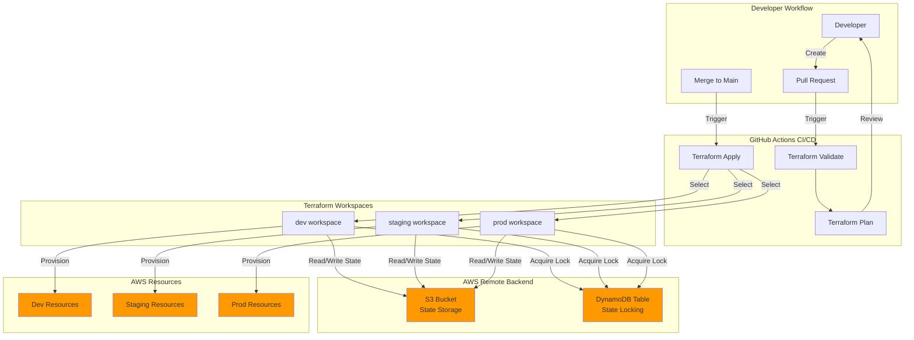

# Arquitectura del Proyecto

## Visión General

Este documento describe la arquitectura del boilerplate de Terraform para AWS con soporte multi-entorno. El proyecto utiliza Terraform workspaces para gestionar múltiples entornos (dev, staging, prod) desde una única base de código, con almacenamiento remoto del estado en S3 y bloqueo mediante DynamoDB.

## Diagrama de Arquitectura



## Componentes Principales

### 1. Flujo de Trabajo del Desarrollador

El ciclo de desarrollo comienza cuando un desarrollador crea cambios en la infraestructura y abre un Pull Request. Este flujo garantiza que todos los cambios sean revisados antes de aplicarse a los entornos.

**Proceso:**
- El desarrollador modifica archivos de configuración de Terraform
- Crea un Pull Request con los cambios propuestos
- El pipeline de CI/CD se activa automáticamente para validar los cambios
- Tras la aprobación, el merge a la rama principal desencadena el despliegue

### 2. Pipeline CI/CD con GitHub Actions

El pipeline automatizado proporciona validación continua y despliegue controlado de la infraestructura.

**Etapas del Pipeline:**

- **Terraform Validate**: Verifica la sintaxis y configuración de Terraform
  - Detecta errores de sintaxis
  - Valida referencias entre recursos
  - Comprueba tipos de variables

- **Terraform Plan**: Genera un plan de ejecución mostrando los cambios propuestos
  - Se ejecuta en cada Pull Request
  - Permite revisar cambios antes de aplicarlos
  - Identifica recursos que serán creados, modificados o eliminados

- **Terraform Apply**: Aplica los cambios a la infraestructura
  - Se ejecuta solo tras merge a la rama principal
  - Despliega cambios en los entornos configurados
  - Actualiza el estado remoto en S3

### 3. Terraform Workspaces

Los workspaces permiten gestionar múltiples entornos desde una única configuración de Terraform, manteniendo estados separados para cada entorno.

**Entornos Soportados:**

- **dev workspace**: Entorno de desarrollo para pruebas rápidas
- **staging workspace**: Entorno de pre-producción para validación
- **prod workspace**: Entorno de producción con datos reales

**Ventajas:**
- Código único para todos los entornos
- Separación clara de estados
- Fácil cambio entre entornos
- Reducción de duplicación de código

### 4. Backend Remoto en AWS

El backend remoto proporciona almacenamiento centralizado y seguro del estado de Terraform, permitiendo la colaboración en equipo.

**Componentes del Backend:**

- **S3 Bucket (State Storage)**:
  - Almacena los archivos de estado de Terraform
  - Estructura de rutas por workspace: `terraform/{workspace}/terraform.tfstate`
  - Cifrado habilitado para proteger información sensible
  - Versionado activado para recuperación de estados anteriores

- **DynamoDB Table (State Locking)**:
  - Previene modificaciones concurrentes del estado
  - Utiliza LockID como clave primaria
  - Garantiza que solo una operación de Terraform se ejecute a la vez
  - Evita corrupción del estado por operaciones simultáneas

### 5. Recursos AWS

Los recursos de infraestructura se despliegan de forma aislada por entorno, permitiendo configuraciones específicas para cada uno.

**Separación por Entorno:**

- **Dev Resources**: Recursos de menor tamaño y costo para desarrollo
- **Staging Resources**: Configuración similar a producción para pruebas
- **Prod Resources**: Recursos de producción con alta disponibilidad

**Características:**
- Etiquetado automático con información del entorno
- Configuración específica mediante archivos `.tfvars`
- Aislamiento completo entre entornos
- Escalado independiente según necesidades

## Flujo de Datos

### 1. Lectura/Escritura del Estado

Cada workspace mantiene su propio archivo de estado en S3:

```
s3://bucket-name/terraform/dev/terraform.tfstate
s3://bucket-name/terraform/staging/terraform.tfstate
s3://bucket-name/terraform/prod/terraform.tfstate
```

**Operaciones:**
- Terraform lee el estado actual antes de cada operación
- Calcula los cambios necesarios comparando estado actual vs. configuración deseada
- Actualiza el estado tras aplicar cambios exitosamente
- El estado cifrado protege información sensible

### 2. Gestión de Bloqueos

DynamoDB gestiona los bloqueos para prevenir conflictos:

**Proceso de Bloqueo:**
1. Terraform solicita un bloqueo antes de modificar el estado
2. DynamoDB verifica si existe un bloqueo activo
3. Si no hay bloqueo, se concede y la operación procede
4. Si hay bloqueo, Terraform espera o falla según configuración
5. El bloqueo se libera al completar la operación

**Beneficios:**
- Previene corrupción del estado
- Permite colaboración segura en equipo
- Proporciona visibilidad de operaciones en curso

### 3. Aprovisionamiento de Recursos

El flujo de aprovisionamiento sigue estos pasos:

1. **Selección de Workspace**: Se selecciona el workspace correspondiente al entorno
2. **Carga de Variables**: Se cargan las variables del archivo `.tfvars` del entorno
3. **Planificación**: Terraform genera un plan de ejecución
4. **Aplicación**: Se crean/modifican/eliminan recursos según el plan
5. **Actualización de Estado**: El estado se actualiza en S3
6. **Liberación de Bloqueo**: Se libera el bloqueo en DynamoDB

## Gestión de Workspaces

### Comandos Principales

```bash
# Listar workspaces disponibles
terraform workspace list

# Crear un nuevo workspace
terraform workspace new <nombre>

# Cambiar a un workspace existente
terraform workspace select <nombre>

# Mostrar workspace actual
terraform workspace show

# Eliminar un workspace
terraform workspace delete <nombre>
```

### Mejores Prácticas

1. **Siempre verificar el workspace activo** antes de ejecutar comandos
2. **Usar nombres consistentes** para los workspaces (dev, staging, prod)
3. **Cargar el archivo .tfvars correcto** para cada workspace
4. **No eliminar workspaces con recursos activos**
5. **Documentar el propósito de cada workspace**

## Almacenamiento del Estado

### Estructura de Archivos de Estado

Los archivos de estado contienen:
- Versión de Terraform utilizada
- Recursos gestionados y sus atributos
- Dependencias entre recursos
- Outputs definidos
- Metadatos de la configuración

### Seguridad del Estado

**Medidas de Seguridad Implementadas:**

1. **Cifrado en Reposo**: S3 server-side encryption (SSE)
2. **Cifrado en Tránsito**: HTTPS para todas las comunicaciones
3. **Control de Acceso**: Políticas IAM restrictivas
4. **Versionado**: Recuperación de estados anteriores
5. **Bloqueo**: Prevención de modificaciones concurrentes

**Información Sensible:**
- Los archivos de estado pueden contener información sensible
- Nunca compartir archivos de estado públicamente
- Restringir acceso al bucket S3 solo a usuarios autorizados
- Considerar el uso de cuentas AWS separadas por entorno

## Relaciones entre Componentes

### Dependencias

```
Developer → Pull Request → CI/CD Pipeline
CI/CD Pipeline → Terraform Workspaces
Terraform Workspaces → Remote Backend (S3 + DynamoDB)
Terraform Workspaces → AWS Resources
```

### Interacciones

1. **Developer ↔ CI/CD**: El desarrollador desencadena el pipeline mediante PRs y merges
2. **CI/CD ↔ Workspaces**: El pipeline selecciona y opera sobre workspaces específicos
3. **Workspaces ↔ Backend**: Los workspaces leen/escriben estado y adquieren bloqueos
4. **Workspaces ↔ Resources**: Los workspaces provisionan y gestionan recursos AWS

## Escalabilidad y Mantenimiento

### Escalabilidad

La arquitectura soporta:
- **Múltiples entornos**: Agregar nuevos entornos creando workspaces adicionales
- **Múltiples regiones**: Configurar providers para diferentes regiones AWS
- **Múltiples equipos**: Colaboración mediante estado remoto y bloqueos
- **Crecimiento de recursos**: Estructura modular permite agregar recursos fácilmente

### Mantenimiento

**Tareas Regulares:**
- Actualizar versiones de Terraform y providers
- Revisar y limpiar recursos no utilizados
- Auditar permisos IAM
- Verificar integridad de archivos de estado
- Actualizar documentación

**Monitoreo:**
- Fallos en el pipeline de CI/CD
- Errores de aprovisionamiento de recursos
- Modificaciones del estado
- Costos por entorno

## Consideraciones de Seguridad

### Autenticación y Autorización

- **GitHub Actions**: Credenciales AWS almacenadas en GitHub Secrets
- **IAM Roles**: Preferir roles IAM sobre credenciales estáticas
- **Principio de Mínimo Privilegio**: Permisos mínimos necesarios
- **MFA para Producción**: Requerir autenticación multifactor

### Protección del Estado

- **Acceso Restringido**: Solo usuarios autorizados pueden acceder al bucket S3
- **Auditoría**: CloudTrail registra todos los accesos al estado
- **Backups**: Copias de seguridad regulares del estado
- **Recuperación**: Procedimientos documentados para recuperación de desastres

### Seguridad de Recursos

- **Etiquetado Automático**: Todos los recursos incluyen tags de seguridad
- **Cifrado por Defecto**: Cifrado habilitado en todos los recursos que lo soporten
- **Grupos de Seguridad**: Configuración restrictiva de acceso a red
- **Políticas IAM**: Permisos granulares para recursos

## Conclusión

Esta arquitectura proporciona una base sólida para la gestión de infraestructura AWS multi-entorno mediante Terraform. Los componentes trabajan en conjunto para ofrecer:

- **Automatización**: Pipeline CI/CD para despliegues consistentes
- **Seguridad**: Gestión segura del estado y credenciales
- **Colaboración**: Estado remoto y bloqueos para trabajo en equipo
- **Escalabilidad**: Estructura modular que crece con las necesidades
- **Mantenibilidad**: Código único para múltiples entornos

La separación clara de responsabilidades entre componentes facilita el mantenimiento y la evolución del proyecto a lo largo del tiempo.
