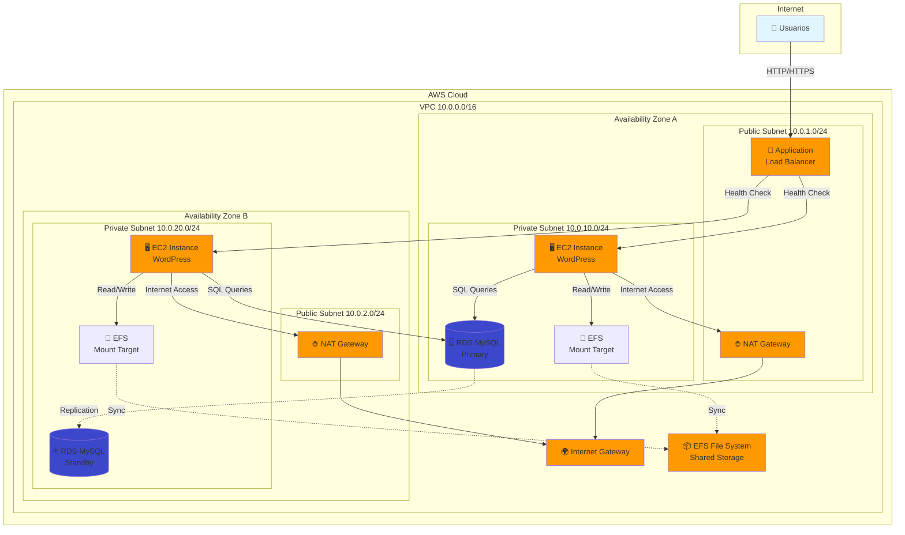

# WordPress High Availability en AWS


**Ejemplo de implementación de WordPress con alta disponibilidad en AWS**  
Arquitectura escalable, resiliente y lista para producción utilizando módulos reutilizables de Terraform.

---

## 📋 Descripción General

Este ejemplo demuestra cómo desplegar una arquitectura de WordPress de alta disponibilidad en AWS utilizando los módulos reutilizables del proyecto. La solución está diseñada para soportar tráfico variable, proporcionar redundancia y garantizar la disponibilidad del servicio.

### Características Principales

✅ **Alta Disponibilidad**: Despliegue Multi-AZ con redundancia en todos los componentes  
✅ **Auto Escalado**: Ajuste automático de capacidad según demanda  
✅ **Almacenamiento Compartido**: EFS para archivos de WordPress (uploads, plugins, themes)  
✅ **Base de Datos Gestionada**: RDS MySQL Multi-AZ con backups automáticos  
✅ **Balanceo de Carga**: Application Load Balancer con health checks  
✅ **Seguridad**: Security groups con principio de mínimo privilegio  
✅ **Multi-Entorno**: Configuraciones separadas para dev, staging y prod  

---

## 🏗️ Arquitectura

### Diagrama de Arquitectura



### Componentes de la Arquitectura

| Componente | Descripción | Alta Disponibilidad |
|------------|-------------|---------------------|
| **VPC** | Red virtual privada con subnets públicas y privadas en 2 AZs | ✅ Multi-AZ |
| **Application Load Balancer** | Distribuye tráfico HTTP/HTTPS entre instancias EC2 | ✅ Multi-AZ |
| **Auto Scaling Group** | Gestiona instancias EC2 con escalado automático | ✅ Multi-AZ |
| **EC2 Instances** | Servidores web con Apache, PHP y WordPress | ✅ Múltiples instancias |
| **RDS MySQL** | Base de datos gestionada con replicación síncrona | ✅ Multi-AZ |
| **EFS** | Sistema de archivos compartido para contenido de WordPress | ✅ Multi-AZ |
| **NAT Gateways** | Acceso a Internet para instancias en subnets privadas | ✅ Multi-AZ |
| **Security Groups** | Firewalls virtuales para control de tráfico | ✅ Stateful |

---

## 💰 Estimación de Costes

Para más detalles sobre los costes estimados por entorno, consulta [docs/cost-estimation.md](docs/cost-estimation.md).

### Resumen de Costes Mensuales (us-east-1)

| Entorno | Coste Estimado | Componentes Principales |
|---------|----------------|-------------------------|
| **Development** | ~$50-70/mes | 1 t3.micro, RDS t3.micro single-AZ, sin backups EFS |
| **Staging** | ~$120-150/mes | 2 t3.small, RDS t3.small Multi-AZ, backups habilitados |
| **Production** | ~$250-350/mes | 2-6 t3.medium, RDS t3.medium Multi-AZ, backups completos |

**Nota**: Los costes reales pueden variar según el uso de datos, transferencias y servicios adicionales.

---

## 📚 Prerequisitos

### Software Requerido

- **Terraform** >= 1.9.0
- **AWS CLI** >= 2.0
- **Git** >= 2.0

### Credenciales AWS

Necesitas una cuenta de AWS con permisos para crear:
- VPC, Subnets, Internet Gateway, NAT Gateway
- EC2 Instances, Auto Scaling Groups, Launch Templates
- Application Load Balancer, Target Groups
- RDS Instances, DB Subnet Groups
- EFS File Systems, Mount Targets
- Security Groups, IAM Roles

### Backend de Terraform

Antes de comenzar, debes tener configurado:
1. **Bucket S3** para almacenar el estado de Terraform
2. **Tabla DynamoDB** para bloqueo de estado

Consulta la [documentación principal](../../README.md#2-inicializar-backend-de-terraform) para instrucciones detalladas.

---

## 🚀 Guía de Despliegue

### 1. Configurar Backend

Edita `main.tf` y actualiza la configuración del backend con tus valores:

```hcl
backend "s3" {
  bucket         = "tu-empresa-terraform-state"  # Tu bucket S3
  key            = "wordpress-ha/${terraform.workspace}/terraform.tfstate"
  region         = "us-east-1"
  dynamodb_table = "terraform-state-lock"  # Tu tabla DynamoDB
  encrypt        = true
}
```

### 2. Configurar Variables Sensibles

Crea un archivo `terraform.tfvars` con las credenciales de la base de datos:

```bash
cd examples/wordpress-ha
cp terraform.tfvars.example terraform.tfvars
```

Edita `terraform.tfvars`:

```hcl
# Credenciales de base de datos (NUNCA commitear este archivo)
db_password = "tu-password-seguro-aqui"

# Configuración de WordPress
wordpress_email = "tu-email@ejemplo.com"
```

**⚠️ IMPORTANTE**: Añade `terraform.tfvars` a `.gitignore` para evitar exponer credenciales.

### 3. Inicializar Terraform

```bash
terraform init
```

### 4. Crear Workspace para el Entorno

```bash
# Para desarrollo
terraform workspace new dev
terraform workspace select dev

# Para staging
terraform workspace new staging
terraform workspace select staging

# Para producción
terraform workspace new prod
terraform workspace select prod
```

### 5. Planificar el Despliegue

```bash
# Desarrollo
terraform plan -var-file=environments/dev.tfvars

# Staging
terraform plan -var-file=environments/staging.tfvars

# Producción
terraform plan -var-file=environments/prod.tfvars
```

### 6. Aplicar la Infraestructura

```bash
# Desarrollo
terraform apply -var-file=environments/dev.tfvars

# Staging
terraform apply -var-file=environments/staging.tfvars

# Producción (requiere confirmación explícita)
terraform apply -var-file=environments/prod.tfvars
```

### 7. Obtener la URL de WordPress

Después del despliegue, obtén la URL del ALB:

```bash
terraform output wordpress_url
```

Ejemplo de salida:
```
wordpress_url = "http://wordpress-ha-dev-alb-123456789.us-east-1.elb.amazonaws.com"
```

### 8. Configurar WordPress

1. Abre la URL en tu navegador
2. Completa el asistente de instalación de WordPress:
   - Título del sitio
   - Usuario administrador
   - Contraseña
   - Email

**Nota**: La base de datos ya está configurada automáticamente mediante el script de user data.

---

## 🔧 Configuración por Entorno

### Desarrollo (dev)

Configuración mínima para pruebas y desarrollo:

- **Instancias EC2**: 1 t3.micro
- **RDS**: db.t3.micro, single-AZ
- **Auto Scaling**: 1-3 instancias
- **Backups**: Retención de 3 días
- **Coste estimado**: ~$50-70/mes

```bash
terraform workspace select dev
terraform apply -var-file=environments/dev.tfvars
```

### Staging (staging)

Configuración que replica producción para pruebas:

- **Instancias EC2**: 2 t3.small
- **RDS**: db.t3.small, Multi-AZ
- **Auto Scaling**: 2-4 instancias
- **Backups**: Retención de 7 días
- **Coste estimado**: ~$120-150/mes

```bash
terraform workspace select staging
terraform apply -var-file=environments/staging.tfvars
```

### Producción (prod)

Configuración optimizada para alta disponibilidad:

- **Instancias EC2**: 2 t3.medium
- **RDS**: db.t3.medium, Multi-AZ
- **Auto Scaling**: 2-6 instancias
- **Backups**: Retención de 30 días
- **Monitoreo detallado**: Habilitado
- **Protección contra eliminación**: Habilitada
- **Coste estimado**: ~$250-350/mes

```bash
terraform workspace select prod
terraform apply -var-file=environments/prod.tfvars
```

---

## 📊 Monitoreo y Operaciones

### Verificar Estado de la Infraestructura

```bash
# Ver recursos creados
terraform state list

# Ver detalles de un recurso específico
terraform show

# Ver outputs
terraform output
```

### Monitoreo en AWS Console

1. **EC2 Auto Scaling**: Verifica el número de instancias activas
2. **CloudWatch Alarms**: Revisa las alarmas de CPU
3. **RDS Monitoring**: Monitorea el rendimiento de la base de datos
4. **ALB Target Health**: Verifica que las instancias estén healthy

### Logs y Debugging

```bash
# Logs de Apache en las instancias EC2
sudo tail -f /var/log/httpd/error_log
sudo tail -f /var/log/httpd/access_log

# Logs de WordPress
sudo tail -f /var/www/html/wp-content/debug.log
```

### Escalado Manual

```bash
# Cambiar la capacidad deseada del ASG
aws autoscaling set-desired-capacity \
  --auto-scaling-group-name wordpress-ha-dev-asg \
  --desired-capacity 3
```

---

## 🔐 Seguridad

### Security Groups

La arquitectura implementa security groups con principio de mínimo privilegio:

| Security Group | Ingress | Egress | Propósito |
|----------------|---------|--------|-----------|
| **ALB** | 80, 443 desde 0.0.0.0/0 | Todo | Acceso público HTTP/HTTPS |
| **EC2** | 80 desde ALB SG | Todo | Solo tráfico desde ALB |
| **RDS** | 3306 desde EC2 SG | Todo | Solo acceso desde EC2 |
| **EFS** | 2049 desde EC2 SG | Todo | Solo acceso NFS desde EC2 |

### Mejores Prácticas Implementadas

✅ **Cifrado en reposo**: RDS y EFS con cifrado habilitado  
✅ **Cifrado en tránsito**: HTTPS para ALB (requiere certificado SSL)  
✅ **Subnets privadas**: EC2, RDS y EFS en subnets sin acceso directo a Internet  
✅ **IAM Roles**: Instancias EC2 con roles IAM en lugar de access keys  
✅ **Backups automáticos**: RDS y EFS con políticas de backup  
✅ **Multi-AZ**: Redundancia en múltiples zonas de disponibilidad  

### Recomendaciones Adicionales

1. **Certificado SSL**: Configura un certificado SSL/TLS en el ALB para HTTPS
2. **WAF**: Considera AWS WAF para protección contra ataques web
3. **Secrets Manager**: Usa AWS Secrets Manager para gestionar credenciales de DB
4. **CloudTrail**: Habilita CloudTrail para auditoría de cambios
5. **GuardDuty**: Activa GuardDuty para detección de amenazas

---

## 🧪 Pruebas

### Prueba de Alta Disponibilidad

1. **Terminar una instancia EC2 manualmente**:
   ```bash
   aws ec2 terminate-instances --instance-ids i-1234567890abcdef0
   ```
   El Auto Scaling Group debería lanzar automáticamente una nueva instancia.

2. **Simular fallo de zona de disponibilidad**:
   - Desactiva todas las instancias en una AZ
   - Verifica que el tráfico se redirija a la otra AZ

3. **Prueba de failover de RDS**:
   ```bash
   aws rds reboot-db-instance \
     --db-instance-identifier wordpress-ha-prod-db \
     --force-failover
   ```

### Prueba de Escalado Automático

1. **Generar carga en el sitio**:
   ```bash
   # Usando Apache Bench
   ab -n 10000 -c 100 http://tu-alb-dns-name/
   ```

2. **Monitorear el escalado**:
   ```bash
   watch -n 5 'aws autoscaling describe-auto-scaling-groups \
     --auto-scaling-group-names wordpress-ha-dev-asg \
     --query "AutoScalingGroups[0].Instances[*].[InstanceId,HealthStatus]" \
     --output table'
   ```

### Prueba de Persistencia de Datos

1. **Subir un archivo a WordPress**
2. **Terminar todas las instancias EC2**
3. **Esperar a que el ASG lance nuevas instancias**
4. **Verificar que el archivo sigue disponible** (gracias a EFS)

---

## 🔄 Actualización y Mantenimiento

### Actualizar la Versión de WordPress

1. Modifica el script `user_data.sh` en el módulo ASG
2. Aplica los cambios:
   ```bash
   terraform apply -var-file=environments/prod.tfvars
   ```
3. El ASG reemplazará gradualmente las instancias

### Actualizar Configuración de RDS

```bash
# Cambiar la clase de instancia en prod.tfvars
db_instance_class = "db.t3.large"

# Aplicar cambios (puede causar downtime breve)
terraform apply -var-file=environments/prod.tfvars
```

### Backup y Restauración

**Backup manual de RDS**:
```bash
aws rds create-db-snapshot \
  --db-instance-identifier wordpress-ha-prod-db \
  --db-snapshot-identifier wordpress-manual-backup-$(date +%Y%m%d)
```

**Restaurar desde snapshot**:
```bash
aws rds restore-db-instance-from-db-snapshot \
  --db-instance-identifier wordpress-ha-prod-db-restored \
  --db-snapshot-identifier wordpress-manual-backup-20260423
```

---

## 🗑️ Destrucción de Recursos

### Desarrollo

```bash
terraform workspace select dev
terraform destroy -var-file=environments/dev.tfvars
```

### Staging y Producción

**⚠️ PRECAUCIÓN**: Asegúrate de tener backups antes de destruir.

```bash
# Crear snapshot final de RDS (si skip_final_snapshot = false)
terraform workspace select prod
terraform destroy -var-file=environments/prod.tfvars
```

---

## 📖 Documentación Adicional

- [Arquitectura Detallada](docs/architecture.md)
- [Estimación de Costes](docs/cost-estimation.md)
- [Guía de Despliegue Paso a Paso](docs/deployment-guide.md)

---

## 🤝 Soporte

Para preguntas o problemas:

1. Revisa la [documentación principal del proyecto](../../README.md)
2. Consulta los [módulos utilizados](../../modules/README.md)
3. Abre un issue en el repositorio de GitHub

---

## 📄 Licencia

Este ejemplo está bajo la Licencia MIT. Consulta el archivo `LICENSE` en la raíz del proyecto.

---

## 👤 Autor

**Tu Nombre**  
Consultor DevOps & Cloud Engineer

- 🌐 Portfolio: [tu-portfolio.com](https://tu-portfolio.com)
- 💼 Malt: [malt.es/profile/tu-perfil](https://malt.es/profile/tu-perfil)
- 📧 Email: tu-email@ejemplo.com

---

⭐ Si este ejemplo te resulta útil, considera darle una estrella al repositorio
